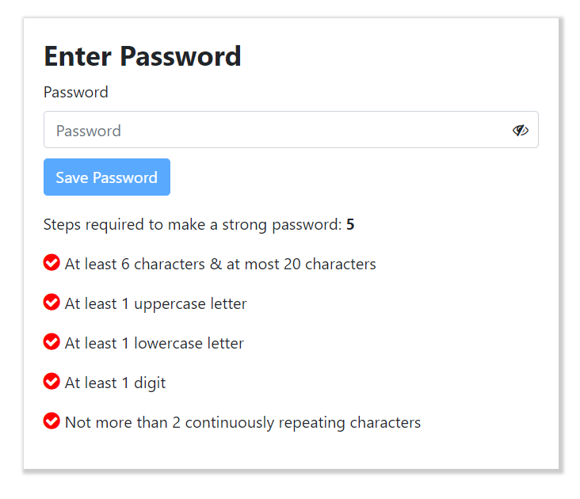

# Password Checker

## 🔥 Demo

Here is the link to the app.

> [The Password Checker app Link](http://ec2-13-127-32-163.ap-south-1.compute.amazonaws.com/)

## 👇 App Screenshot

<p align="center">
  
</p>

## 💻 Run the code locally

- Clone the project or download the project as zip
- Open the folder in VS Code

### 🗔 Frontend

- Open Integrated Terminal in VS Code & navigate to frontend folder
  ```
  cd .\frontend\
  ```
- Install the dependencies by running the following command
  ```
  npm install
  ```
- Then, add a file called `.env` inside the frontend folder
- In `.env` file, add a variable called `REACT_APP_API_URL` & assign the API url like the below example
  ```
  REACT_APP_API_URL=http://localhost:5000
  ```
- Now run the project using the following command
  ```
  npm start
  ```

### Other Frontend scripts available

Run Unit test cases

```
npm test
```

Lint the code

```
npm run lint
```

Build the code

```
npm run build
```

### 🖧 Backend

- Open Integrated Terminal in VS Code & navigate to backend folder
  ```
  cd .\backend\
  ```
- Install the dependencies by running the following command
  ```
  npm install
  ```
- Then, add a file called `config.env` inside the config folder in backend folder
- In `config.env` file, add the PORT & MONGO_URI like the below example
  ```
  PORT=5000
  MONGO_URI=mongodb://localhost/test
  ```
- Now run the project using the following command
  ```
  npm run dev
  ```

# Absolute difference between sum of arrays

Run the following command to view the output of the program in console

```
node MinAbsoluteDifference.js
```
